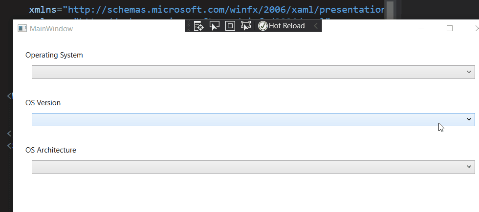
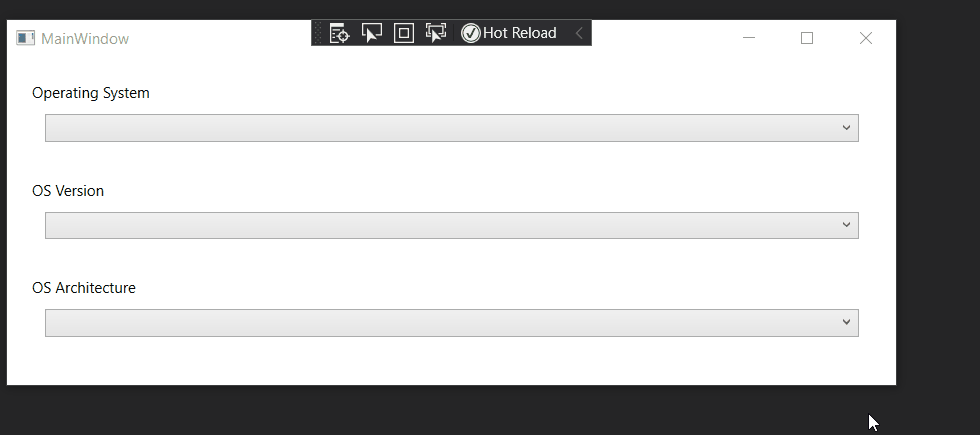

# Devour Master Detail XML in WPF

Key points to this practise set:

- How are resources compiled to output folder (.\bin\Debug\\) Folder.
- How can the application recognize .xml file resources
- Build to content or resource?
- How to use the XPATH.

## Summary

This project aims to recreate the original example on github for WPF Samples, regarding master details.

## Dissecting the original

The file leagues.xml is stored under {project}\data folder.

Build Action is set to "Content", Copy to Output is set to "Copy if Newer".

The result is that under the Debug folder, it is copied to a folder named Data, and with itself.

## It works!

There are several issues. The first one being that the XPATH selects only the first element of the nodes.

### <span style="Border-Radius:15px;BackGround:Gold;Padding:0px 15px">Key Point</span> The `XMLDataProvider` class

This is the class that provides data to the Data Context.

```xaml
		<XmlDataProvider x:Key="MyList" Source="Data\Leagues.xml"
                       XPath="Leagues/League"/>
        <DataTemplate x:Key="DataTemplateX">
            <TextBlock Text="{Binding XPath=@name}" />
        </DataTemplate>
```

First of all, the provider defines the xml resource <span style="color:gray">(doesn't have to be a file, it can be embedded xml syntax inside the xaml document) </span>. In this particular example, the XPATH selects the from the nodes named League under all Leagues branch.

The second component is the Data Template, now, this template is useful in multiple occasions, what it does is for control objects that takes a data template as its property, it would dictate how to present the data, including the string format, the control wrapper, etc.

<span style="border-radius:0px 10px;background:lightblue;padding:0px 15px">About Binding</span> Binding in WPF works like a hiearchy. To directly refer to the current level, simply use the `{Binding}` syntax. To build upon that, use the `{Binding Path=$path}` to further bind the object. In this case, use the XPath property to recursively query the selected nodes, in this case, extracts all the name property.

```xaml
    <Window.Resources>
        <XmlDataProvider x:Key="OSList" Source="data/tbl_osinfo.xml"
                         XPath="/dataroot/tbl_osinfo"/>
    </Window.Resources>
    <StackPanel Margin="10" DataContext="{Binding Source={StaticResource OSList}}">
        <HeaderedContentControl Header="Operating System" Margin="10">
            <ComboBox x:Name="cbxOS" Margin="10" ItemsSource="{Binding}">
                
            </ComboBox>
        </HeaderedContentControl>
        ...
```

This is the simplest binding to XPath. It would go through all the listed tbl_osinfo objects with all the elements concatenated without delimiters.



For this to imitate the effects of the example, we then make a data template, for that combo box to use where it isolate the os_name node.

With the Data Template, the osname can be singled out.

```xaml
<HeaderedContentControl Header="Operating System" Margin="10">
            <ComboBox x:Name="cbxOS" Margin="10" ItemsSource="{Binding}">
                <ComboBox.ItemTemplate>
                    <DataTemplate>
                        <TextBlock >
                            <TextBlock.Text>
                                <Binding XPath="os_name[not(os_name = preceding::os_name)]"/>
                            </TextBlock.Text>
                        </TextBlock>
                        
                    </DataTemplate>
                </ComboBox.ItemTemplate>
            </ComboBox>
        </HeaderedContentControl>
```




## <span style="Border-Radius:15px;BackGround:Gold;Padding:0px 15px">Key Point</span> Selecting unique nodes

Unfortunately the XPATH 2.0 support is not useful. 

There are ways to support showing only unique values online by adding conditional node select syntax, but to think about it it complicates the detail selection.

The most logical way is to have something that does the conversion of exporting xml from the databases.

<span style="border-radius:0px 10px;background:lightblue;padding:0px 15px">Microsoft Access: Export to XML with a transformation</span>

There is a transformation option in Access where it allows you to select a transformation file, .xsl, or .xslt.

And this can be done, also it looks like a really common problem.

So:

##  <span style="Border-Radius:15px;BackGround:Gold;Padding:0px 15px">Key Point</span><span style="text-decoration:line-through;color:red">Selecting unique nodes</span> Restructuing a XML using XLS

So the example online is:

https://stackoverflow.com/questions/4322197/restructuring-xml-file

The person is asking for changing

```xml
<?xml version="1.0" encoding="UTF-8"?>
<countries>
	<AD>
		<region>Andorra</region>
		<region>Parròquia de Canillo</region>
	</AD>
	<AE>
		<region>Abū Z̧aby</region>
		<region>‘Ajmān</region>
    </AE>
	<CN>
		<region>Anhui</region>
		<region>Zhejiang</region>
    </CN>
</countries>
```

to a more structrued format, like this:

```xml
<?xml version="1.0" encoding="UTF-8"?>
<contries>
	<country code="AD">
        <region>Andorra</region>
		<region>Parròquia de Canillo</region>
    </country>
	<country code="AE">
		<region>Abū Z̧aby</region>
		<region>‘Ajmān</region>
    </country>
	<country code="CN">
		<region>Anhui</region>
		<region>Zhejiang</region>
    </country>    
</contries>
```

The solution is the xslt that look like this:

```xml
<xsl:stylesheet version="1.0" xmlns:xsl="http://www.w3.org/1999/XSL/Transform">

   <xsl:output method="xml" indent="yes"/>

   <xsl:template match="node() | @*">
       <xsl:copy>
          <xsl:apply-templates select="node() | @*" />
       </xsl:copy>
   </xsl:template>

   <xsl:template match="countries/*">
       <country code="{name()}">
          <xsl:apply-templates select="region"/>
       </country>
   </xsl:template>
</xsl:stylesheet>
```

One thing to note is that the xsl is a style sheet, just like the CSS is a style sheet for HTML, the XSL and XSLT are style sheet for XML files.

first line is the declearation.

Second line dictates the output format as xml, with indent enabled.

https://www.w3schools.com/xml/xsl_intro.asp

The basic idea goes like this, the XSL or XSLT uses XPATH to select nodes and elements to put into a structured template, and generate another xml (but not just limited to xml, html can be generated as well) based on the syntax, using XPATH queries as variables to replace them.

Let's just try on our own example:

<span style="border-radius:0px 10px;background:lightblue;padding:0px 15px">Create xslt file</span>

<p style="background:beige;padding:10px">Ah I finally understand the point of Visual Studio Code with Visual Studio. 
    </p>
I used to think VS Code is useless. VS Code is a lightweight IDE. **It doesn't mean that it does less than the VS**. Like heavy weaponaries and small firearms, their **roles** are different! You have to factor in the scenario, the development cost, the run time, etc., and here VS Code is perfect for building small JavaScripts apps, XSL/XSLT files, for testing or running purposes.

This is the example for it: I need an xslt file for exporting data out of a database, but it doesn't go well with the project at hand. I only needed the result xml file; nor would I need this file in the future, so, where do I put this xslt file?

But, I digress.

Generate an xslt using VS template.

Ah, so the first line is always copy all to template.

Original XML:

```xml
<?xml version="1.0" encoding="UTF-8"?>
<dataroot xmlns:od="urn:schemas-microsoft-com:officedata" xmlns:xsi="http://www.w3.org/2001/XMLSchema-instance"  xsi:noNamespaceSchemaLocation="tbl_osinfo.xsd" generated="2020-08-26T17:39:12">
    <tbl_osinfo>
        <ID>1</ID>
        <os_name>Amazon Linux</os_name>
        <os_version>2015.09 or later</os_version>
        <os_architecture>64-bit</os_architecture>
    </tbl_osinfo>
    <tbl_osinfo>
        <ID>10</ID>
        <os_name>Microsoft Windows</os_name>
        <os_version>10 Enterprise Edition</os_version>
        <os_architecture>64-bit</os_architecture>
    </tbl_osinfo>
    <tbl_osinfo>
        <ID>11</ID>
        <os_name>Microsoft Windows</os_name>
        <os_version>10 Professional Edition</os_version>
        <os_architecture>64-bit</os_architecture>
    </tbl_osinfo>
    <tbl_osinfo>
        <ID>12</ID>
        <os_name>Microsoft Windows</os_name>
        <os_version>7 Enterprise Edition</os_version>
        <os_architecture>64-bit</os_architecture>
    </tbl_osinfo>
    <tbl_osinfo>
        <ID>13</ID>
        <os_name>Microsoft Windows</os_name>
        <os_version>7 Enterprise Edition</os_version>
        <os_architecture>32-bit</os_architecture>
    </tbl_osinfo>
</dataroot>
```

After Restructure:

```xml
<tbl_osinfo>
    <osinfo name="Amazon Linux">
    	<osversion name="2015.09 or later">
        	<os_architecture>64-bit</os_architecture>
        </osversion>
    </osinfo>
    <osinfo name="Microsoft Windows">
    	<osversion name="7 Enterprise Edition">
            <os_architecture>64-bit</os_architecture>
            <os_architecture>32-bit</os_architecture>
        </osversion>
        <osversion name="10 Enterprise Edition">
            <os_architecture>64-bit</os_architecture>
        </osversion>
        <osversion name="10 Professional Edition">
            <os_architecture>64-bit</os_architecture>
        </osversion>
    </osinfo>
</tbl_osinfo>
```

And try to create the xslt:


